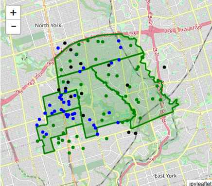

GeoSIR
======

Overview
--------

* Developed within the `Mesa Geo framework <https://mesa-geo.readthedocs.io/latest/examples/geo_sir.html>`_
* Agent-based model. Two agent types: Person and Neighbourhood.
* Epidemiological and spatiotemporal agent-based model. Simulates diffusion dynamics of diseases.
* 4 compartments: Susceptible; Infected; Recovered; Dead.
* Functionality has been extended to include contact network inference via `Virus on a Network <https://mesa.readthedocs.io/latest/examples/basic/virus_on_network.html>`_.
