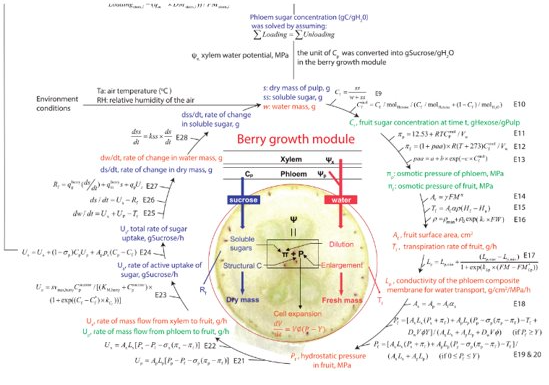

JFruit2
=======

Overview
--------

* Developed by INRAe Avignon, originally for peaches.
* Simulates key traits: Fresh weight, dry weight, sugar metabolism etc.
* Mechanistic model: Build upon physical and biochemical principles.
* Parameters are physiologically meaningful and interpretable.
* Requires fewer calibration data than purely data-driven models.
