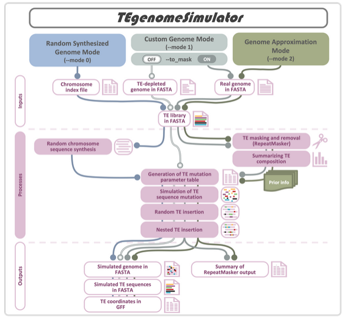

TEgenomeSimulator
=================

Overview
--------

* A tool to simulate transposable element (TE) mutation and insertion into a random-synthesised or user-provided genome.
* The resulting simulated genome can be used for benchmarking TE detection tools.
* Three running modes:
    * Mode 0: Random Synthesized Genome mode.
    * Mode 1: Custom Genome mode.
    * Mode 2: TE Composition Approximation mode.
* Accessible at: https://github.com/Plant-Food-Research-Open/TEgenomeSimulator
* Funding: KRIP Genome Landscape Objective led by Susan Thomson
